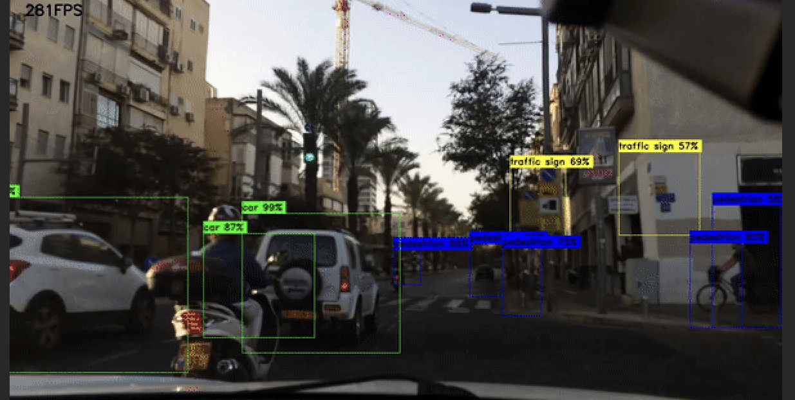
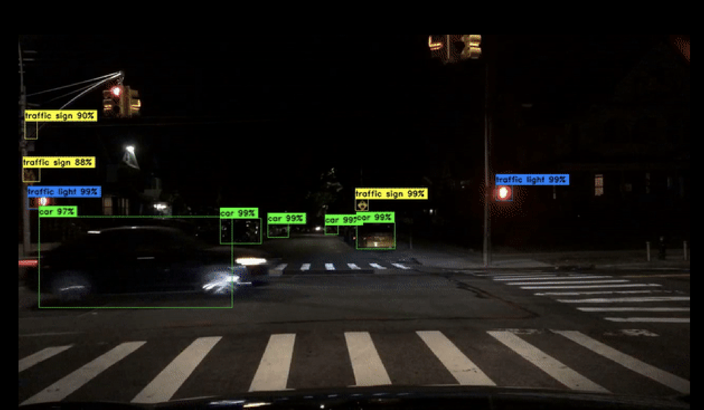

# T

An advanced deep learning system for real-time traffic monitoring and safety analysis, capable of detecting unsafe scenarios for blind people and autonomous vehicles using multiple neural network architectures with edge device compatibility.

## Features
- **Real-Time Video Processing**: Efficiently processes video streams from traffic cameras.
- **Multi-Model Analysis**: Utilizes MobileNetV2, Custom CNN, Dilated CNN, and YOLOv9 for scenario detection.
- **Ensemble Classification**: Combines model predictions for robust scene classification.
- **Safety Alerts**: Triggers alerts for high-risk situations.
- **Performance Monitoring**: Tracks accuracy, recall, and frame-per-second (FPS) performance.

---

## Dataset can be accessed on below drive link
[


---

## Tech Stack
- **Programming Language**: Python (>= 3.8)
- **Deep Learning Frameworks**: TensorFlow (>= 2.9), PyTorch
- **Computer Vision**: OpenCV (>= 4.5), PIL
- **Data Handling**: NumPy, Pandas
- **Other Frameworks**: natsort, glob, argparse

---

## Performance Metrics
| Model       | mAP  | Precision | Recall |
|-------------|------|-----------|--------|
| MobileNetV2 | 0.834 | 0.876     | 0.891  |
| Custom CNN  | 0.812 | 0.854     | 0.867  |
| Dilated CNN | 0.856 | 0.889     | 0.902  |
| YOLOv9      | 0.892 | 0.912     | 0.923  |






---

## Installation

1. Clone the repository:
   ```bash
   git clone git@github.com:gowthamddy/Cross-model-spatial-Intelligence-Model.git
   cd Cross-model-spatial-Intelligence-Model
   ```
2. Try to install latest versions of all libraries or frameworks used.

3. Ensure CUDA is installed for GPU acceleration if you have less powerful GPU or processor.

---

## Requirements for efficient running of model
- 16GB RAM or more
- GPU with 8GB+ VRAM
- CUDA-compatible GPU
- Ubuntu 20.04+ or Windows 10+ or MacOS

---

## Contributing
Contributions are welcome! Feel free to share the issues or pull requests to enhance the project overall.

---

## Acknowledgements
- TensorFlow and PyTorch communities for helping
-stackoverflow community for debugging
-deeplearning.ai community for helping
